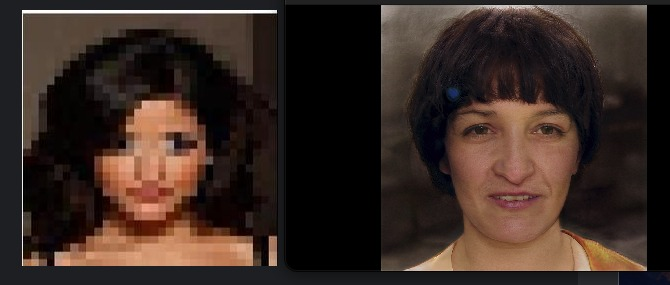
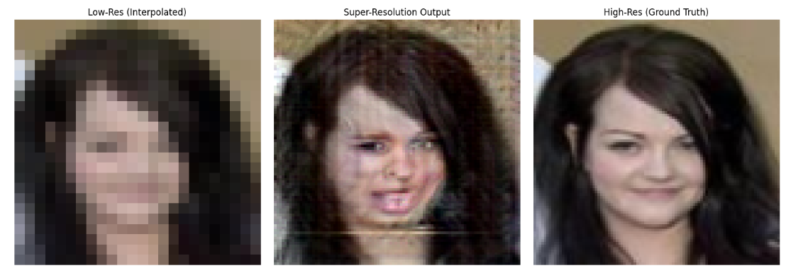
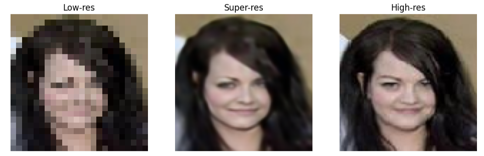
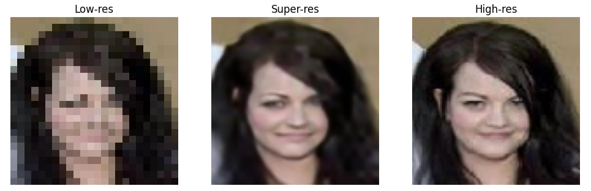

# Face Hallucination

Низька роздільна здатність зображень облич є поширеною проблемою в багатьох сферах, наприклад системи відеомоніторингу, криміналістика, обробка старих фотографій, системи розпізнавання облич тощо.

**Face Hallucination** - різновид *super-resolution*, спеціально розроблена для відновлення деталей та підвищення роздільної здатності зображень обличь, заснована на знаннях про їх будову.

Мета - перетворити розмиті або низькоякісні зображення облич у зображення високої роздільної здатності, використовуючи знання про типові риси обличчя зі збереженням ідентичності особи.

Зазвичай вхідні зображення для Face Hallucination мають роздільну здатність 32x24 або 16x12 пікселів, а метою є досягнення роздільної здатності 96x96 пікселів або вище. *Основною проблемою є збереження ідентичності та реалістичності обличчя.*

*Відомі методи*:
- інтерполяція
- методи на основі теореми Баєса
- нейронні мережі (CNN)
- генеративно-змагальні мережахі (GAN).

Архітектури мереж:
- SRGAN (Super-Resolution Generative Adversarial Network), Real-ESRGAN, SF-SRGAN
- PULSE (Self-Supervised Photo Upsampling via Latent Space Exploration of Generative Models) [GitHub](https://github.com/alex-damian/pulse)
- Attention-FH (Attention-Aware Face Hallucination)[Source](https://arxiv.org/abs/1708.03132)
- SRResNet (Super-Resolution Residual Network) [Source](https://arxiv.org/abs/1609.04802)
- C-Face network [Source](https://arxiv.org/abs/1503.03832)

## Dataset [download](https://drive.google.com/file/d/1Qv2c8UN87Wq2qGlyQnPEMh9kj6n87oL8/view?usp=sharing)
Використовувався dataSet зібраний з FFHQ 2, CelebA та зображень з Інтренет (**209813** зображень 89x109)

## Результати:
Результат оцінювався субєктивним порівнянням з оригіналом.

**PULSE** модель генерувала реалістичні зображення, які не мали нічого спільного із вхідним зображенням.

Модель *SRGAN* показала дуже погані результати:

Можна зробити висновок, що даний тип мережі не підходить для вирішення задачі.

Спрощена модель **SRResNet**. 

Використовував upsampling через PixelShuffle (DepthToSpace) та ресідуальні з'єднання. Мережа показала найкращий результат.

Спрощена модель **C-Face network**. 

Це енкодер-декодерна найпростіша в реалізації модель без ресідуальних з'єднань. Показала трішки гірший результат ніж SRResNet.

## Плани
Потрібно поєднати C-Face network та SRResNet.
